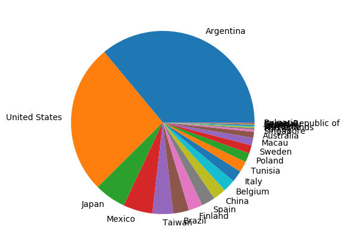
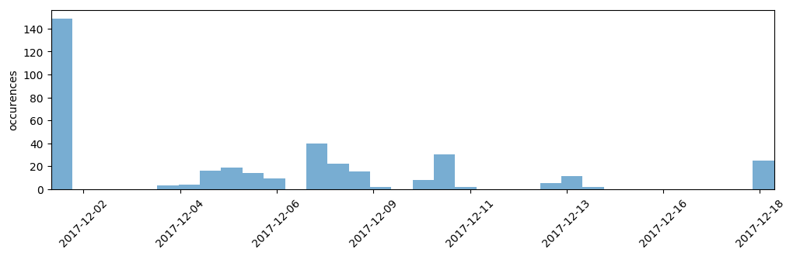

.. _basic_example:

Basic example
-------------

An example showcasing some Lala routines.

.. literalinclude:: ../../examples/basic_example.py

**Outputs:**

.. image:: ../../examples/basic_example_worldmap.png
   :alt: [piechart]
   :align: center
   :width: 550px

.. image:: ../../examples/basic_example_frequent_visitors.png
  :alt: [piechart]
  :align: center
  :width: 350px
